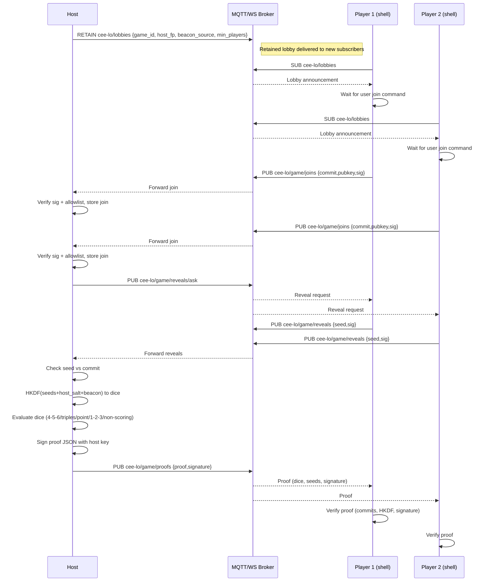

# Cee-Lo MQTT/WS North Star (Sequence)

## CLI Shell UX (planned)
- `fair-dice ceelo shell --mqtt ws://localhost:8080` starts an interactive shell:
  - Subscribes to `cee-lo/lobbies` and `cee-lo/<game>/proofs`.
  - Shows lobby list; user can `join <game> [--hand h]`.
  - Generates/loads key; sends commit; on reveal request auto-reveals (or manual `reveal`).
  - Displays live events: joins, reveal asks, proofs, dice results.

## Topics (stable)
- `cee-lo/lobbies` (retained): lobby announcements.
- `cee-lo/<game>/joins`: signed commits.
- `cee-lo/<game>/reveals`: signed seeds.
- `cee-lo/<game>/reveals/ask`: host prompt to reveal now.
- `cee-lo/<game>/proofs`: signed proof bundle (dice, seeds, salt, beacon, signature).
- Optional `cee-lo/<game>/acks`: host feedback (join accepted/rejected).
